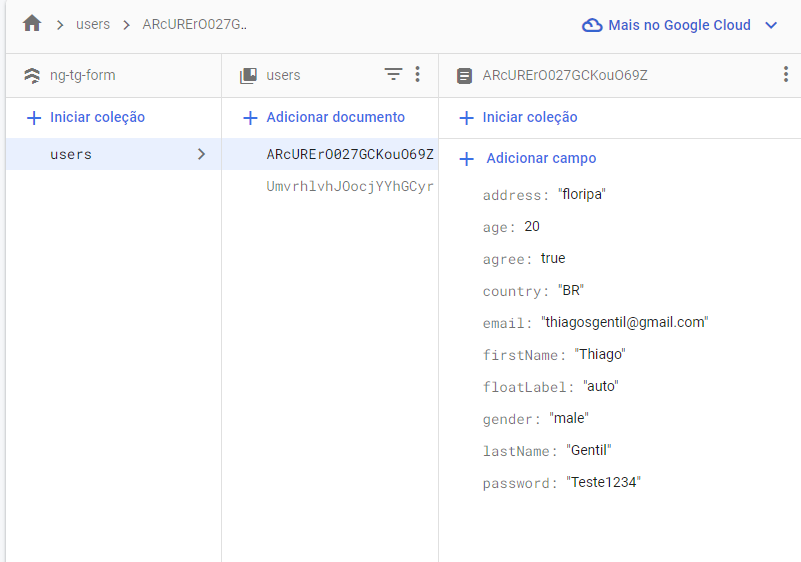

# Projeto Angular Forms com Firestore

[](https://github.com/Tgentil) [](https://ng-tg-form.web.app/)

Neste projeto, o objetivo principal era aprofundar o entendimento sobre formulários reativos no Angular 16 e aprender a conectar um projeto Angular ao Firestore. Também foi utilizada a biblioteca Angular Material na versão 16.2.0 para estilização e componentização.

## Sobre o Projeto

**O que é um Formulário Reativo?**  
Um formulário reativo é um formulário HTML associado ao RxJS para gerenciar seu estado como uma transmissão em tempo real. Isso significa que você pode ouvir alterações em seu valor como um Observable e reagir de acordo com erros de validação, feedback, operações de banco de dados, entre outros.

### Funcionalidades Principais:

1. **Formulário Básico**: A essência de um formulário reativo começa aqui, com a criação de controles simples e a conexão desses controles ao formulário.
   
2. **Formulários Aninhados**: Com a complexidade crescente, temos formulários dentro de formulários para gerenciar dados mais complexos e estruturados.

3. **Formulários Dinâmicos com FormArray**: Permite que os usuários adicionem múltiplos campos dinamicamente, como vários números de telefone para uma conta.

4. **Validação de Formulário**: Garante que os dados inseridos pelo usuário sejam válidos antes de serem enviados para um banco de dados.

5. **Envio de Formulários Reativos**: A integração com o Firestore permite que os dados do formulário sejam armazenados em um banco de dados em tempo real.

## Interpolação e Reatividade

No Angular, a interpolação é uma maneira de vincular expressões em templates HTML a propriedades de um componente TypeScript. Utilizamos a sintaxe `{{ valor }}` para alcançar isso. Em todos os formulários deste projeto, há uma interpolação que exibe o valor atual do formulário em formato JSON. Isso é feito usando a interpolação combinada com o pipe `json`, como no exemplo a seguir:

```html
<div class="form-preview">Value: {{ myForm.value | json }}</div>
```
Essa abordagem ajuda a visualizar a reatividade do projeto em tempo real. À medida que os dados são inseridos ou modificados nos formulários, a visualização JSON reflete imediatamente essas alterações, demonstrando a natureza reativa dos formulários no Angular.

## firestore 📷



## Inspiração

Este projeto foi fortemente inspirado pelo tutorial do Fireship, adaptado para atender às necessidades específicas e ao aprendizado desejado:  

[](https://www.youtube.com/watch?v=JeeUY6WaXiA&ab_channel=Fireship)

